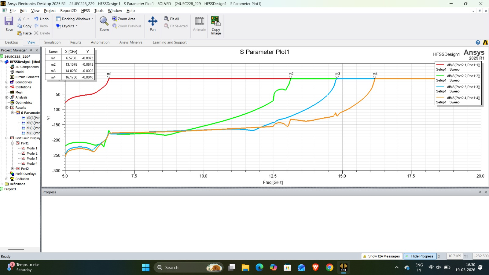
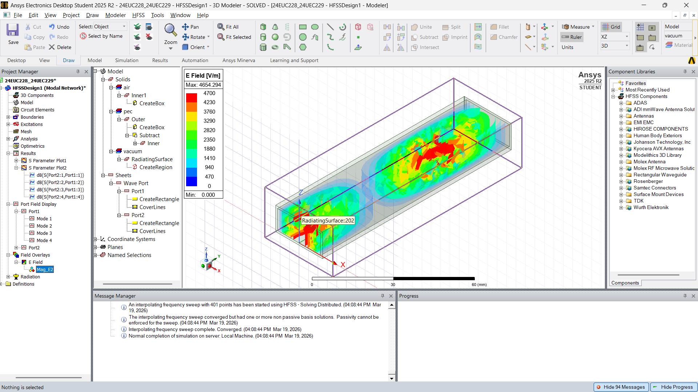
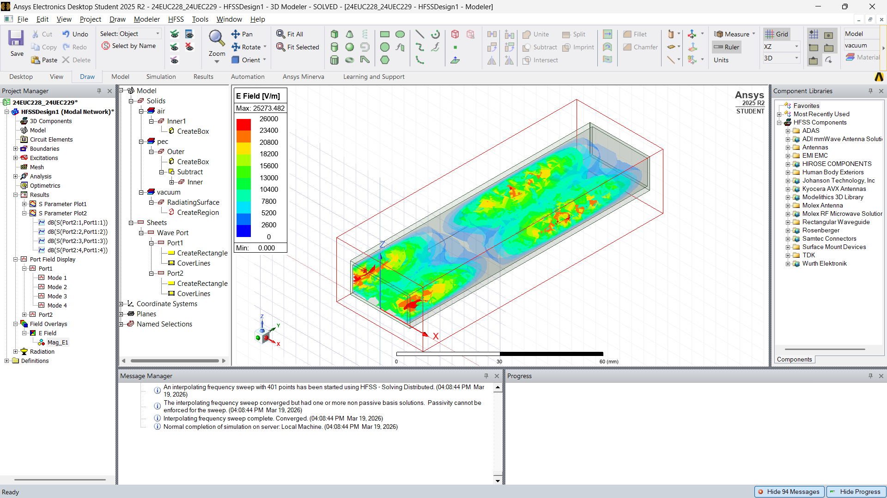

##### **Overview**

Simulation and analysis of a rectangular waveguide using HFSS to study mode propagation, cutoff frequencies, and electromagnetic field distribution.

##### **Objectives**

* Analyze TE modes (TE₁₀, TE₂₀, TE₀₁, TE₁₁)
* Study cutoff frequency behavior
* Evaluate S-parameters across frequency range
* Visualize electric field distributions

##### **Design Parameters**

* Frequency range: 5–20 GHz
* Waveguide dimensions: (put your values here)
* Material: PEC walls, air-filled

##### **Key Results**

###### S-Parameters 

* TE₁₀ cutoff observed at \~6.5 GHz 
* Higher-order modes appear at higher frequencies 

###### Mode Analysis

* TE₁₀ → dominant mode
* Higher modes (TE₂₀, TE₀₁, TE₁₁) observed beyond cutoff

##### **Key Learnings**

* Relationship between waveguide dimensions and cutoff frequency
* Mode propagation behavior
* Importance of dominant mode in waveguide design

